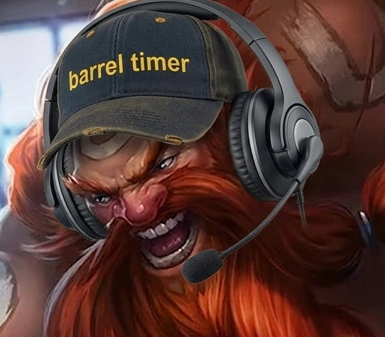

<div align="center">


</div>

# Barrel Timer - Gragas Edition
<p align="center">
  
</p>

Barrel Timer is a tactical tool for League of Legends designed to track enemy Summoner Spells through voice commands. This allows players to register cooldowns in real-time without interrupting gameplay or manual typing.

---

> [!IMPORTANT]
> **Barrel Timer** is a convenience tool, not automation. It provides information a player could otherwise obtain with a manual stopwatch. 
> - **Zero Integration:** It does not read from or write to the game's memory.
> - **No Overlay:** The application runs as a background tool and can be set on a secondary monitor; it does not inject any visual elements into the game client.
> - **Privacy & Performance:** Voice recognition is processed 100% offline. No data is sent to external servers.

## Features


- **Voice Recognition:** Integrated offline speech engine for hands-free cooldown logging.
- **Dynamic Cooldown Calculation:** Automated tracking for Flash, Teleport, Ignite, and other spells.
- **Ionian Boots Integration:** Manual toggle for Summoner Spell Haste per role.
- **Audio Alerts:** Vocal notifications when tracked enemy spells are available.
- **Responsive Interface:** Adaptive UI designed for secondary monitors and different resolutions.

---

## Usage

1. **Game Time Sync:** Match the internal clock with the League of Legends match timer using the +/- controls.
2. **Voice Registration:** State the role followed by the spell (e.g., "Mid Flash", "Support Ignite").
3. **Teleport Logic:** Toggle "Unleashed TP" after the 10-minute mark to update cooldown values.
4. **Haste Adjustment:** Select the Ionian Boots icon for specific roles to apply reduction.

---

## Installation

Ensure you have a microphone properly configured in your operating system before launching.

1. **Clone the repository:**
  ```bash
  git clone https://github.com/R3ner/Barrel-Timer.git
  ```
2. Navigate to the directory:
  ```bash
  cd Barrel-Timer
  ```
3. Install required dependencies (You need Python 3.13 installed please avoid 3.14 experimental version because some libs are not yet updated for it):
  ```bash
  pip install -r requirements.txt
  ```
4. (⚠️DO NOT SKIP THIS STEP⚠️) **Download the Voice Recognition Model:**
   The application requires an offline **Vosk** model to process voice commands:
   - Download the **Small American English** model from [Vosk Models](https://alphacephei.com/vosk/models).
   - We gonna use: `vosk-model-small-en-us-0.15` (Lightweight for low CPU usage).
   - Extract the downloaded folder into the project root and rename it to `models`.
   - It should look like this `/Barrel-Timer/models/vosk-model-small-en-us-0.15/`
   
5. Execute the application:
  ```bash
  python main.py
  ```

## User Experience - Shorcut for quick launch

<details>
<summary><b>Click to expand: Don't want to use the console every time? Create a Shortcut!</b></summary>
<br>

You can launch **Barrel Timer** like a standard Windows application by creating a custom desktop shortcut:

1. **Create the Shortcut:**
   * Right-click on your Desktop -> **New** -> **Shortcut**.
2. **The "Target" Field:**
   * Paste the path to your `pythonw.exe` followed by the path to your `main.py` file.
   * *Example:* `C:\Python3\pythonw.exe "C:\Users\Your_User\Documents\Barrel-Timer\main.py"`
     also `pythonw.exe "C:\Users\Your_User\Documents\Barrel-Timer\main.py"` can work perfectly too.
   * *(Note: Using **pythonw** ensures the app runs in the background without a console window!)*
3. **Custom Icon:**
   * Right-click the shortcut -> **Properties** -> **Change Icon**.
   * Select the `barrel-timer.ico` file from the `/Barrel-Timer/assets/images/` folder.

Now you can just double-click your icon and start timing spells instantly! :D
</details>

## Technical Overview

<details>
<summary><b>Click to expand: How it works?</b></summary>
<br>

The application operates as a standalone Python process, independent of the League of Legends client. Here is the technical workflow:

1. **Audio Capture:** The system initializes a localized audio stream using the `SoundDevice` library, capturing input from the default system microphone.
2. **Offline Inference:** Captured audio is processed by a **Vosk** Lightweight Model. This happens entirely on your local CPU; no voice data is transmitted to external APIs or cloud services.
3. **Keyword Detection:** A custom parser monitors the transcribed text for specific "Role + Spell" patterns (e.g., "Mid Flash").
4. **State Management:** Upon detection, the internal engine calculates the specific cooldown based on active modifiers (Ionian Boots, Unleashed TP status) and starts a non-blocking asynchronous timer.
5. **UI & Audio Feedback:** The PySide6 interface updates the countdown visually, and a localized audio cue is triggered once the timer reaching zero via `Pygame.mixer`.

</details>

## Credits & Attributions

This project uses high-quality assets and sounds from the community:

* **Sound Effects:**
    * Sound Effect 1 by [Universfield](https://pixabay.com/users/universfield-28281460/) via Pixabay.
    * Sound Effect 2 by [freesound_community](https://pixabay.com/users/freesound_community-46691455/) via Pixabay.
    * Sound Effect 3 by [Paul (PWLPL)](https://pixabay.com/users/pwlpl-16464651/) via Pixabay.
    * Sound Effect 4 by [LIECIO](https://pixabay.com/users/liecio-3298866/) via Pixabay.
    * Sound Effect 5 by [Universfield](https://pixabay.com/users/universfield-28281460/) via Pixabay.

### Legal Disclaimer: Barrel Timer is not endorsed by Riot Games and doesn't reflect the views or opinions of Riot Games or anyone officially involved in producing or managing League of Legends. League of Legends and Riot Games are trademarks or registered trademarks of Riot Games, Inc.

<div align="center">

Tool developed by [R3ner](https://github.com/R3ner)

<br>

[](https://ko-fi.com/r3ner)

</div>
